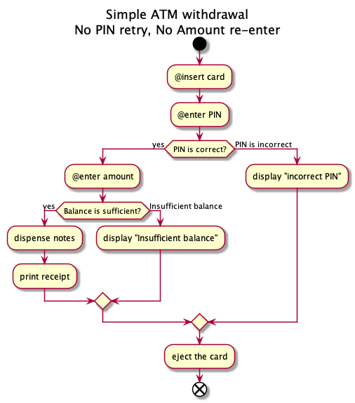

# cupl

A CLI tool for automatic **CU**cumber gherkin feature files generation from **PL**antuml activity diagram.

[](https://oclif.io)
[](https://npmjs.org/package/cupl)
[](https://circleci.com/gh/cinoss/cupl/tree/master)
[](https://ci.appveyor.com/project/cinoss/cupl/branch/master)
[](https://codecov.io/gh/cinoss/cupl)
[](https://npmjs.org/package/cupl)
[](https://github.com/cinoss/cupl/blob/master/package.json)

Cupl will help you transform `.puml` file of this diagram.



Into this Gherkin feature description

```gherkin
Feature: Simple ATM withdrawal
  No PIN retry, No Amount re-enter

  Scenario: Successful transaction
    Given Entered Correct PIN number
      And Balance is sufficient
    When enter amount
    Then dispense notes
      And print receipt
      And eject the card

  Scenario: The world is not enough
    Given Entered Correct PIN number
      And Insufficient balance
    When enter amount
    Then display "Insufficient balance"
      And eject the card

  Scenario: PIN is incorrect
    Given User's PIN is 111111
    When insert card
      And User enters 111112
    Then display "incorrect PIN"
      And eject the card
```

<!-- toc -->

- [cupl](#cupl)
- [Usage](#usage)
<!-- tocstop -->

# Usage

<!-- usage -->

```sh-session
$ npm install -g cupl
$ cupl <file path>
running command...
$ cupl (-v|--version|version)
cupl/0.0.4 darwin-x64 node-v10.16.0
$ cupl --help [COMMAND]
USAGE
  $ cupl FILE
...
```

<!-- usagestop -->
